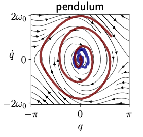

# Adaptive exploration of nonlinear systems

We introduce a fast exploration algorithm for nonlinear system. FLEX is a lightweight model-based pure exploration policy maximizing the Fisher information.

## Paper

Our algorithm is described in our paper [FLEX: an Adaptive Exploration Algorithm for Nonlinear Systems](https://arxiv.org/abs/2304.13426), accepted at ICML 2023.

## Demo
An animated demonstration of our algorithm in various environments can be found in
[this video](https://youtu.be/hGpkdz8-8vU).


## Citation

To cite this work, please use the following references.

> Blanke, M., & Lelarge, M. (2023). FLEX: an Adaptive Exploration Algorithm for Nonlinear Systems. arXiv preprint arXiv:2304.13426.


~~~bib
@article{blanke2023flex,
  title={FLEX: an Adaptive Exploration Algorithm for Nonlinear Systems},
  author={Blanke, Matthieu and Lelarge, Marc},
  journal={arXiv preprint arXiv:2304.13426},
  year={2023}
}
~~~
## Organization

An agent is defined by an exploration policy, which can be found in `policies.py` along with baselines. Pre-defined environments and models  available in directories `environments` and `models`. Given an environment, an agent, a time horizon, and an evaluation function, the function `exploration` runs the exploration algorithm and returns the resulting state-action values and evaluation values.


## Example

The following code can be executed by running `python exploration.py`.

```python
from environments.pendulum import DampedPendulum
from models.pendulum import Linear
from policies import Random, Flex
from exploration import exploration

T = 300
dt = 1e-2
environment = DampedPendulum(dt)


environment = Environment()
model = Model(environment)
evaluation = model.evaluation

# agent = Random(
agent = Flex(
model,
environment.d,
environment.m,
environment.gamma,
dt=environment.dt
)


z_values, error_values = exploration(environment, agent, T, evaluation)

```

The phase space trajectories and the error curves obtained in the example above for agents Random (blue) and FLEX (red) are presented in the figures below.




